这篇文章整理自我的图形学渲染大作业。

## Whitted-Style 光线追踪

### 材质、折射、反射与阴影

从相机向每个像素打一条主光线。光线击中物体后，如果材质是普通漫反射，就用 Phong 直接光照计算颜色；如果是反射材质，就沿镜面反射方向递归；如果是折射材质，就按 Snell 定律计算折射方向，折射失败时说明发生了全反射，于是改成反射方向递归。

反射方向使用课程中的公式：

$$
r = d - 2(d · n)n
$$

其中 $d$ 是入射方向，$n$ 是交点法线，$r$ 是反射方向。折射方向根据折射率计算。

Shadow ray 的作用是判断光源和当前漫反射点之间有没有遮挡。每次计算直接光照前，从交点向光源方向发射阴影光线，如果在到达光源前先与物体相交，则不累加这个光源的 Phong 贡献。方向光则看作光源在无穷远处。

Whitted-Style 的主流程如下：

```text
for each pixel:
    ray = camera.generateRay(pixel center)
    color = traceWhitted(ray, 0)
    write color
```

`traceWhitted()` 的递归逻辑如下：

```text
traceWhitted(ray, depth):
    if depth is too large:
        return background

    intersect scene
    if miss:
        return background

    if material is reflective:
        trace reflected ray

    if material is refractive:
        compute refracted ray
        if total internal reflection:
            trace reflected ray
        otherwise:
            trace refracted ray

    otherwise:
        for each light:
            send shadow ray
            if not blocked:
                add Phong shading
```

这里有漫反射地面、彩色墙、反射球和折射球。反射球可以看到周围环境的颜色，折射球后方物体发生偏折，地面上也能看到 shadow ray 带来的阴影。

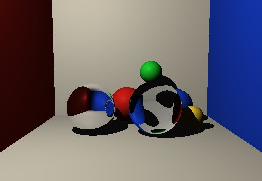

## 路径追踪

路径追踪部分支持面光源，无穷递归的终止策略使用 Russian Routelette；基于物理的渲染使用蒙特卡洛积分计算 Radiance；支持漫反射、理想折射、理想反射材质；支持 Cook-Torrance BRDF；也支持 NEE（Next Event Estimation）对光源采样。

### 蒙特卡洛积分、面光源与基础材质

基础路径追踪会对每个像素发射多条带随机偏移的相机光线，然后通过递归随机反弹估计 radiance。它支持漫反射、理想反射、理想折射、glossy 和自发光面光源。

路径追踪使用 Monte Carlo 方法估计渲染方程：

$$
Lo(x, wo) = Le(x, wo) + ∫ Li(x, wi) fr(x, wi, wo) cos(\theta) dwi
$$

把积分写成采样估计后就是：

$$
Lo ~= Le + Li(wi) * fr(wi, wo) * cos(\theta) / pdf(wi)
$$

漫反射和 glossy 都在法线所在的半球上均匀采样。概率密度是 $pdf(wi) = 1 / (2\pi)$ 因此每次间接路径的权重统一按照 $fr * cos(\theta) / pdf$ 计算。漫反射 BRDF 为 $albedo / \pi$，代入后得到 $2 * albedo * cos(\theta)$。

理想反射和理想折射沿对应方向继续递归。折射材质中如果发生全反射，就改为反射方向。

基础路径追踪的像素循环如下：

```text
for each pixel:
    color = 0
    repeat spp times:
        ray = camera.generateRay(pixel + random jitter)
        color += tracePath(ray, useNEE = false)
    color /= spp
    write color
```

不带 NEE 时，`tracePath()` 的逻辑如下：

```text
tracePath(ray):
    intersect scene
    if miss:
        return background

    if hit emissive material:
        return emission

    if depth is large:
        use Russian Roulette

    if diffuse or glossy:
        sample a hemisphere direction
        trace next ray

    if reflective:
        trace reflected ray

    if refractive:
        trace refracted ray
        use reflected ray only for total internal reflection
```

下图是不带 NEE 的路径追踪结果，采样数为 128 spp。

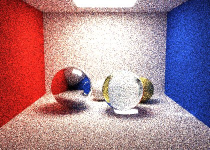

### Russian Roulette

路径追踪中加入 Russian Roulette 以提高性能。路径深度超过 3 后，根据当前材质颜色估计继续概率，再随机决定是否终止。

路径追踪若追踪多层，计算量很大。Russian Roulette 用概率方式终止路径，可以减少平均路径长度，同时保持为无偏估计。

如果继续概率是 `p`，路径继续时把后续贡献除以 `p`：

```text
E[result] = p * contribution / p + (1 - p) * 0 = contribution
```

实现时在路径深度超过 3 后处理 Russian Roulette。继续概率取材质 albedo 的最大分量，并限制在 `[0.2, 0.9]` 之间：

```text
if depth > 3:
    continueProb = clamp(maxComponent(albedo), 0.2, 0.9)
    if random() > continueProb:
        return black
    otherwise:
        trace next ray and divide by continueProb
```

限制上下界主要是为了避免概率太小造成权重太大，也避免概率一直接近 1 而失去终止作用。

### Cook-Torrance Glossy BRDF

这一部分实现 Cook-Torrance BRDF，用来表示介于理想镜面和漫反射之间的 glossy 表面。粗糙度越低，高光越集中，反射越接近理想镜面；粗糙度越高，高光越宽，反射越接近漫反射。

glossy 材质用 Cook-Torrance BRDF 计算 BRDF 值，用于 NEE 的直接光照和半球采样得到的间接光照。

Cook-Torrance BRDF 用微表面模型描述粗糙表面的镜面反射，包括三个部分：

- `D`：Beckmann 法线分布，用来描述微表面法线的集中程度。
- `G`：Cook-Torrance 几何遮蔽项，用来限制微表面的自遮挡。
- `F`：Schlick Fresnel，用来描述入射角变化带来的反射率变化。

镜面项为：

$$
fr_{specular} = D(h) * F(v,h) * G(l,v) / (4 * (n·l) * (n·v))
$$

最终 BRDF 是漫反射项和镜面项相加：

$$
fr = (1 - F) * diffuseColor / \pi + fr_{specular}
$$

glossy 分支在 `tracePath()` 中处理：

```text
if material is glossy:
    if useNEE:
        sample direct light with Cook-Torrance BRDF
    sample one direction uniformly on the hemisphere
    brdf = CookTorranceBRDF(normal, viewDir, sampleDir)
    weight = brdf * cos / pdf
    trace next ray
```

这个场景从左到右分别放了理想镜面、三个不同 roughness 的 glossy 材质、玻璃和普通漫反射球。三颗金色 glossy 球只改变 roughness：

| 材质 | roughness | 观察结果 |
| --- | ---: | --- |
| Glossy 1 | 0.08 | 高光集中，反射更清晰，更接近理想反射材质 |
| Glossy 2 | 0.28 | 高光开始变宽，仍然保留明显反射感 |
| Glossy 3 | 0.78 | 高光很宽且模糊，整体更接近漫反射材质 |

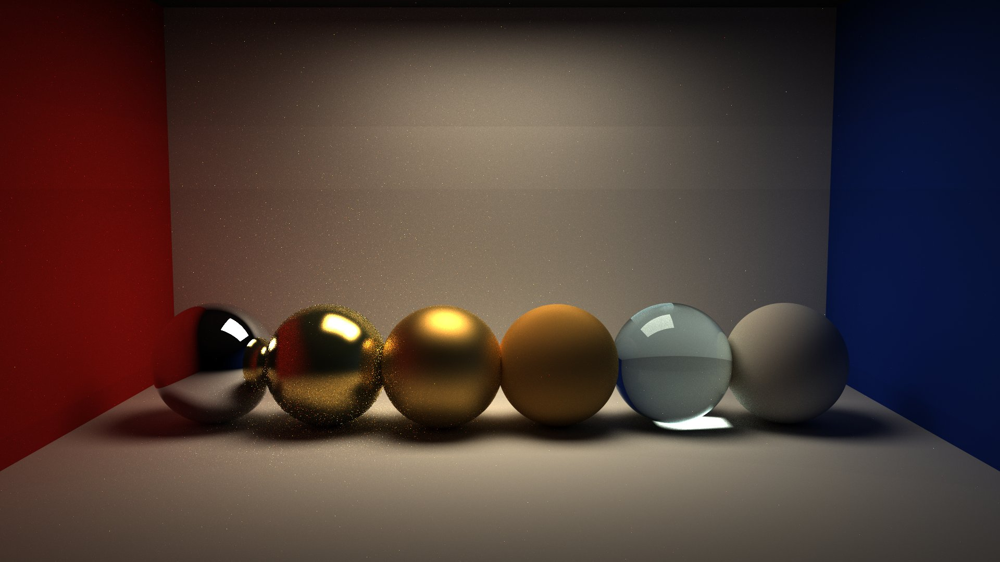

### Next Event Estimation 与 Shadow Ray

这一部分实现了带 NEE 的路径追踪。程序在非镜面交点处主动采样面光源上的一个点，估计直接光照，并用 shadow ray 判断当前点到光源采样点之间是否可见。

普通路径追踪需要随机反弹方向刚好打到光源，直接光照收敛比较慢。NEE 的做法是对光源面积进行采样。这样每个非镜面交点都有机会直接估计一次光源贡献，加速收敛，减少噪声。

使用面积采样形式计算面光源贡献：

$$
L_{direct} = Le * fr * cos_{surface} * cos_{light} / (distance^2 * pdf_{area})
$$

其中 $cos_{surface}$ 是当前表面朝向光源的余弦项，$cos_{light}$ 是光源表面朝向当前点的余弦项，$distance$ 是两点距离，$pdf_{area}$ 是面积采样的概率密度。实现时先按面积随机选一个三角形光源，再在三角形内部均匀采样。

NEE 作为直接光照项加入 `tracePath()`：

```text
directLight = 0
if useNEE and material is not reflective/refractive:
    sample one point on emissive triangles
    send shadow ray
    if visible:
        add direct light

sample next indirect direction
incoming = tracePath(nextRay)
return directLight + indirect contribution
```

开启 NEE 后，漫反射和 glossy 的后续随机路径如果直接命中光源，会返回 0 以避免重复计算。对于反射或折射，仍然允许下一条路径命中光源。

下面两张图都使用 128 spp。第一张是不带 NEE 的路径追踪，第二张是带 NEE 的路径追踪。


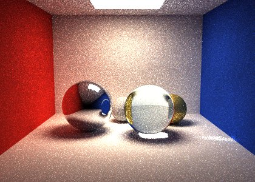

**对比：**

没有 NEE 时，当前表面点只会向半球随机采样反弹方向；如果某个方向没有刚好打到顶部的发光三角形，这条路径就没有直接光源贡献。对于面积有限的光源来说，“随机反弹后命中光源”概率较低，所以很多样本贡献为 0，少数命中光源的样本贡献很亮，噪点较多。

开启 NEE 后，每个非镜面交点都会主动在发光三角形上采样一个点，并用 shadow ray 检查可见性。因此在同样 128 spp 下，地面和漫反射墙面上的直接光照更连续，光源附近的亮斑和阴影边缘也更稳定，收敛速度更快。

### Whitted-Style 光线追踪和路径追踪对比

这里再比较 Whitted-Style 光线追踪和路径追踪。两张图使用同一个场景，物体、相机和盒子构图保持一致；场景中同时提供了给 Whitted 使用的点光源，以及给路径追踪采样的 emissive triangle 面光源。

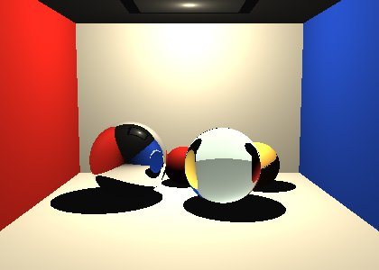

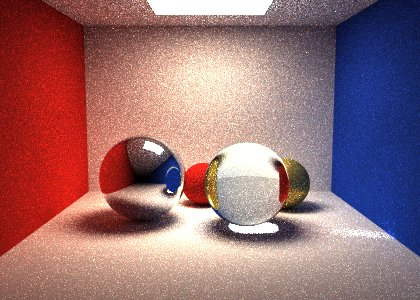

第一个不同是噪声。Whitted-Style 是确定性的递归光追，每个像素只追踪主光线、反射光线、折射光线和到点光源的 shadow ray，所以有锐利阴影。路径追踪是随机采样渲染方程，有限 spp 下会有 Monte Carlo 噪声，尤其是发光面附近、glossy 球和间接照明较强的区域。

第二个不同是光照模型。Whitted-Style 中，漫反射表面主要使用 Phong 局部光照模型，只计算光源直接照到当前点的贡献；反射和折射只沿理想镜面方向递归。因此它的反射、折射轮廓清楚，但漫反射物体之间不会自然产生多次颜色反弹。路径追踪则把直接光照和间接光照统一写在渲染方程里，光线可以在漫反射、glossy、反射和折射材质之间继续反弹，所以盒子墙面、地面和物体之间会出现更整体的环境照明，还会有真实的模糊阴影边缘和玻璃球下的亮斑。

## Fresnel 系数

Fresnel 系数用来控制折射界面上反射光和折射光的比例。

真实玻璃和水不会只折射。光线打到介质界面时，一部分会反射，一部分会折射，而且反射比例和入射角有关。正面看时反射比较弱，接近掠射角时反射会变强。

使用 Schlick 近似计算 Fresnel：

$$
F = F_0 + (1 - F_0)(1 - cos(\theta))^5
$$

其中：

$$
F_0 = ((eta_t - eta_i) / (eta_t + eta_i))^2
$$

对于折射率 1.80 的玻璃，在 10 度、45 度和 80 度入射时，Schlick 近似的反射率大约为：

$$
F(10^\circ) = 0.0816
$$

$$
F(45^\circ) = 0.0836
$$

$$
F(80^\circ) = 0.4355
$$

水和玻璃的临界角分别为：

$$
\theta_{water} = arcsin(1 / 1.33) ~= 48.8^\circ
$$

$$
\theta_{glass} = arcsin(1 / 1.80) ~= 33.7^\circ
$$

按此计算可以设计对比场景：一组场景展示不同入射角下反射率的变化，特别是大角度入射时 Fresnel 带来的变化。场景里有三块透明玻璃薄片，折射率设为 1.80，三块薄片和相机视线的夹角大约是 10 度、45 度和 80 度。另一组场景用来比较水和玻璃，左边水楔形体折射率是 1.33，右边玻璃楔形体折射率是 1.80。观察视角和物体的入射恰好可以在部分面上形成是否全反射的不同。

Whitted-Style 中，折射材质会同时算反射和折射，然后用 Fresnel 系数混合：

```text
reflected = trace(reflectedRay)
if total internal reflection:
    return reflected

refracted = trace(refractedRay)
F = computeFresnel(rayDirection, normal, ior)
return F * reflected + (1 - F) * refracted
```

路径追踪中则用 Fresnel 系数作为概率，随机选择反射或折射方向：

```text
if random() < F:
    trace reflected ray
else:
    trace refracted ray
```

第一组图是同一场景下关闭和开启 Fresnel 的对比，注意到黄球在玻璃附近的效果有明显的区别。

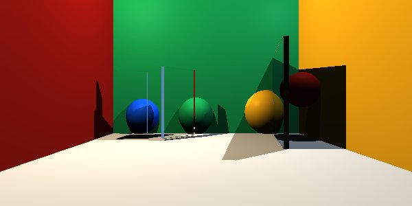

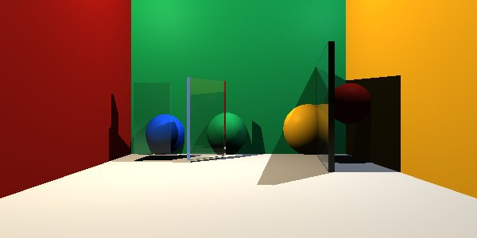

路径追踪版本：

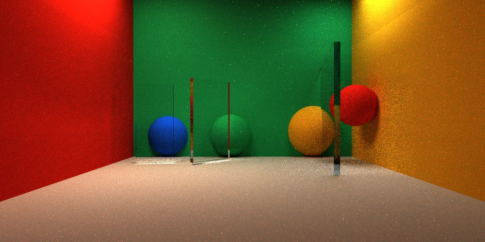


第二组图是水和玻璃的对比。左侧水楔形体折射率为 1.33，右侧玻璃楔形体折射率为 1.80。因为出射角约为 42 度，水中光线可以折射出去，而玻璃内部会发生全反射。

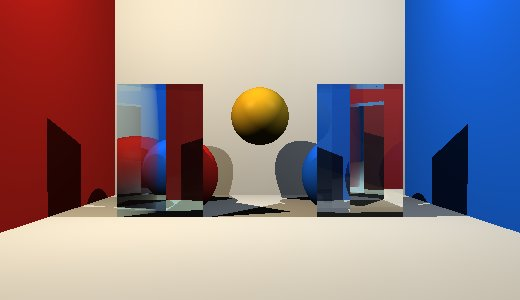

路径追踪版本：

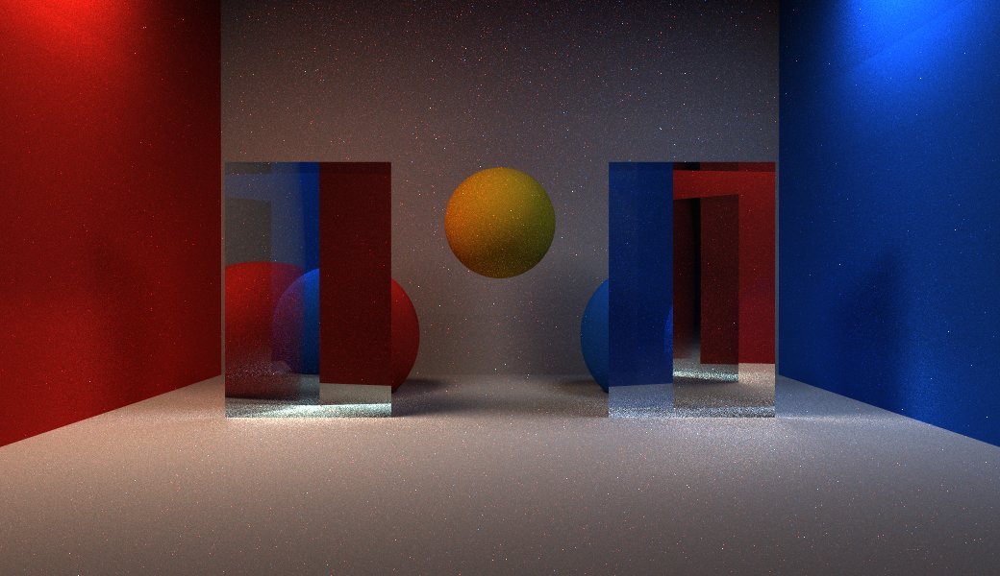

## 三角网格 AABB/BVH 求交加速

这一部分实现了复杂网格模型及其求交加速。

为三角网格增加了一个简单 BVH。每个节点存一个 AABB，叶子节点存少量三角形编号，内部节点有左右子节点。

AABB 是和坐标轴对齐的包围盒。光线和 AABB 求交时，可以分别计算它进入和离开 x、y、z 三个 slab 的参数区间。如果三个区间没有交集，就说明光线不会打到盒子里的三角形。

BVH 的作用是把很多三角形组织成层次包围盒。求交时先测当前节点的 AABB。如果光线没有打到这个包围盒，就可以跳过整个子树；如果打到了，再继续访问子节点或叶子节点中的三角形。这样可以少做大量无关三角形的求交。

读取网格后，先计算每个三角形的 AABB 和中心点，然后构建 BVH。每个节点选择中心点包围盒最长的轴，把三角形按中心点二分。叶子节点阈值是 8 个三角形。

```text
buildBVHNode(triangle range):
    compute node AABB
    if triangle count <= 8:
        make leaf node
    else:
        axis = longest axis of centroid bounds
        split triangles by centroid
        build left and right child
```

然后从根节点开始递归访问 BVH：

```text
intersectBVHNode(node, ray):
    if ray misses node AABB:
        return false
    if node is leaf:
        intersect contained triangles
    else:
        visit left and right child
```

性能对比使用 bunny 场景。场景中共有 1000 个三角形；分辨率为 200 x 160，采样数为 8 spp。

| 场景 | 分辨率 | SPP | 无 BVH | BVH | 加速比 |
| --- | --- | --: | ---: | ---: | ---: |
| bunny 场景 | 200 x 160 | 8 | 93.8129 s | 1.01717 s | 约 92.2x |

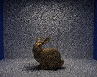

## 三角网格纹理贴图与法线贴图

这一部分实现了三角网格纹理贴图和法线贴图。读取网格纹理坐标后，在三角形求交处插值得到命中点的 UV。颜色贴图用来根据 UV 采样 albedo，法线贴图用来采样切线空间法线并改变 shading normal。

纹理贴图就是把三角形表面的二维 UV 坐标映射到图像颜色。光线击中三角形后，先根据重心坐标插值三个顶点的 `vt`，得到命中点 UV，再用这个 UV 去采样颜色贴图。采样出来的颜色会乘到材质本身的 diffuseColor 上，作为路径追踪里的 albedo。

对于带 UV 的三角形，先用三角形边和 UV 差分算出 tangent 和 bitangent，再把贴图中读到的局部法线从切线空间转到世界空间。为了做 material ball 展示，我也给 `Sphere` 增加了球面 UV：用球面法线的 `atan2(z, x)` 得到横向坐标，用 `asin(y)` 得到纵向坐标，再用球面上的 tangent / bitangent 把同一张法线贴图贴到球体上。

读取网格时保存纹理坐标。三角形求交命中后，重新计算重心坐标，并设置命中点的 UV。

```text
hit triangle:
    compute barycentric coordinates
    uv = alpha * uv0 + beta * uv1 + gamma * uv2
    if material has normalTexture:
        build tangent and bitangent
        localNormal = sample normal texture
        normal = tangent space normal transformed to world space
    hit.set(t, material, normal, uv)
```

之后根据命中点 UV 得到当前点的颜色。如果材质没有贴图，就仍然使用原来的常量 diffuseColor。

如下展示了铺路石贴图的球和立方体。

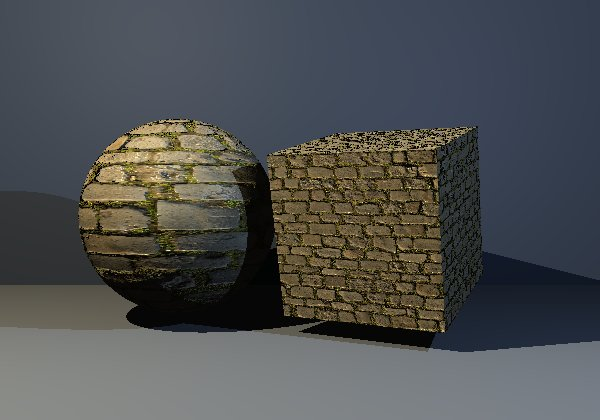

如下展示了两只 Spot 牛，左侧只有颜色贴图，右侧是颜色+法线贴图，可以明显看到大面积花纹、脚部和鼻子附近有法线贴图的痕迹。

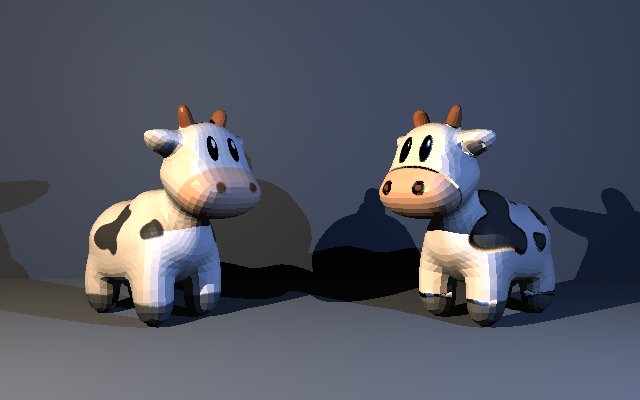

以下是路径追踪版本。

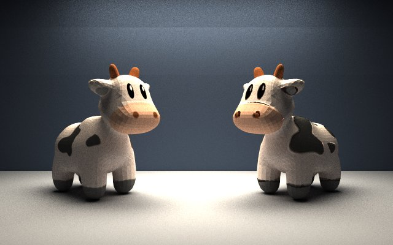

## OpenMP CPU 并行加速

这一部分实现了基于 OpenMP 的 CPU 并行路径追踪。

路径追踪的像素估计可以写成很多独立的小任务。一个像素的随机采样不会读写另一个像素的结果，所以可以把不同扫描行分配给不同 CPU 线程。这里使用 OpenMP 的 `parallel for`，并用 `schedule(dynamic, 1)` 动态分配每一行。这样天空、车身、玻璃和地面的计算量不均匀时，线程不会因为某一块区域特别慢而长时间空等。

原本的路径追踪使用了一个全局随机数生成器。这在串行里没问题，但在多线程里会产生数据竞争。为了让并行结果稳定，我改成每个像素根据 `(x, y)` 生成独立随机数种子。这样同一个像素在串行和 OpenMP 模式下使用同一串随机数，不受线程调度顺序影响。

并行后的像素循环如下：

```text
parallel for each row y:
    for each pixel x:
        rng = seed(x, y)
        color = 0
        repeat spp times:
            ray = camera.generateRay(pixel + random jitter)
            color += tracePath(ray, rng)
        write pixel color
```

| 模式 | 线程数 | 时间 |
| --- | ---: | ---: |
| 串行 | 1 | 1252.03 s |
| OpenMP | 8 | 254.815 s |

加速比为：

```text
1252.03 / 254.815 ~= 4.91x
```

## 综合展示

这张综合展示图同时展示 BVH、NEE 面光源、Cook-Torrance glossy 车身、Fresnel 玻璃车窗、带颜色贴图和法线贴图的地面和 Spot Cow，可以看到左右不同颜色的墙体在车身上的反光效果，放大后可以看到车窗玻璃内部有内饰的轮廓以及后侧灰色墙面的透射，也有 Fresnel 带来的后方照明方块的反光，车灯内结构透过车灯处的玻璃显示出来，复杂网格按材质分块渲染。

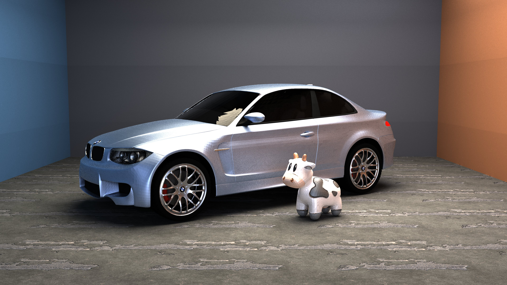
